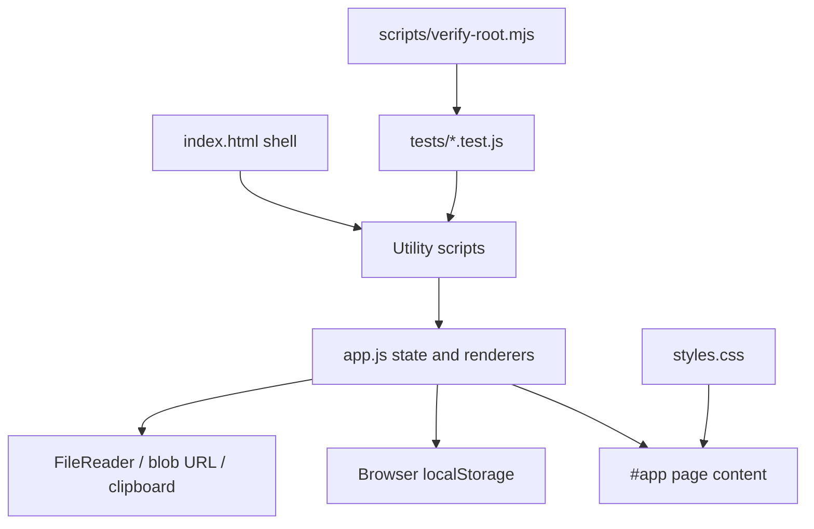
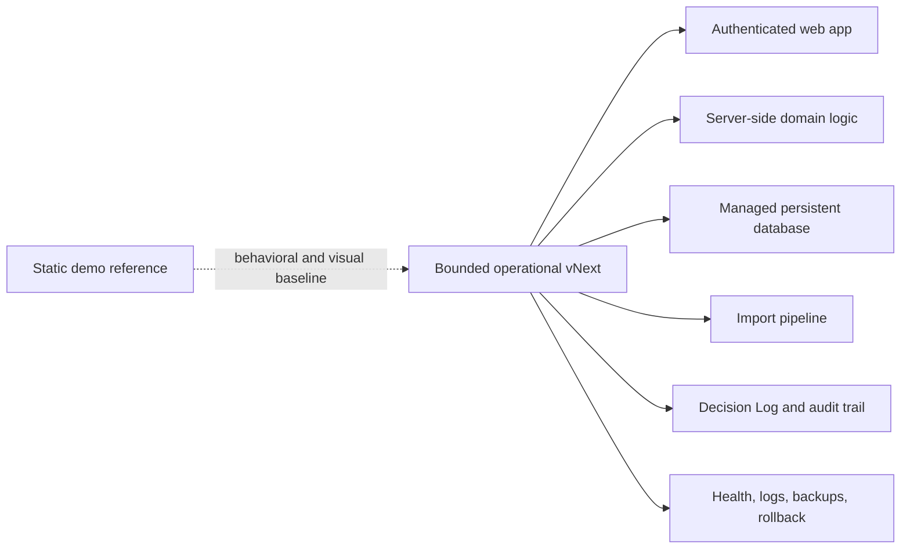

# System Architecture

## Document Status

- Status: Partially Verified
- Primary Evidence:
  - `index.html`
  - `app.js`
  - `styles.css`
  - `demoShared.js`
  - `pilotIntakeSafety.js`
  - `operationalCompression.js`
  - `operationalImpact.js`
  - `demoWalkthrough.js`
  - `pilotReadinessPack.js`
  - `demoControlCenter.js`
  - `tests/`
  - `scripts/verify-root.mjs`
  - `.github/workflows/root-static-checks.yml`
  - `apps/operational/`
  - `.github/workflows/operational-ci.yml`
  - `docs/cmtcommand-vnext/baseline.md`
  - Founder decision recorded in the Phase 2 Founder Truth Capture task, 2026-07-13
  - Founder decision recorded in the Phase 3 Guarded Operational Architecture Selection task, 2026-07-13
- Last Reviewed: 2026-07-13

## Current Architecture - Confirmed

Root CMTCommand is a static HTML/CSS/JavaScript app. No root package manager, framework, backend, database, API route directory, auth service, schema, migration system, or deployment config was found.

## Current Major Layers

- Shell: `index.html` defines sidebar, topbar, search, appearance selector, theme button, global results, and `#app`.
- State/rendering: `app.js` owns demo data, state, page renderers, navigation, event wiring, localStorage reads/writes, copy, import, and download behavior.
- Styling: `styles.css` owns tokens, panels, badges, buttons, responsive rules, dark theme, and Command Center mode.
- Utilities: dependency-free UMD modules expose browser globals and CommonJS exports for tests.
- Tests: Node tests exercise deterministic utility behavior and static integration checks such as script order.
- CI: GitHub Actions workflow runs `node scripts\verify-root.mjs`.

## Script Load Order

`index.html` currently loads:

1. `demoShared.js`
2. `pilotIntakeSafety.js`
3. `operationalCompression.js`
4. `operationalImpact.js`
5. `demoWalkthrough.js`
6. `pilotReadinessPack.js`
7. `demoControlCenter.js`
8. `app.js`

`app.js` depends on utility globals. `pilotIntakeSafety.js` must precede `demoControlCenter.js` and `app.js`.

## Current State Management

- In-memory `state` object in `app.js`.
- Browser localStorage for known display/demo keys.
- Session-only Pilot Setup import/document state.
- No server-side state.

## Current External Services

No product external service integrations were found. Browser capabilities used locally:

- `FileReader`
- `localStorage`
- `navigator.clipboard`
- generated `blob:` URLs

The browser/CDP validation script under `docs/cmtcommand-vnext/artifacts/` uses local HTTP and Edge CDP for verification; it is not product runtime.

## Founder Decision - 2026-07-13

The current static application must remain intact as the trusted demo, product-reference implementation, and visual behavior baseline.

The operational pilot cannot remain a browser-local static application. It needs persistent server-side data, authentication, multiple users, role-based authorization, organization and office scoping, durable imports, durable readiness snapshots, an auditable Decision Log, managed deployment, monitoring, backups, and rollback.

Do not rewrite the existing demo in place. Create a clearly bounded operational implementation while preserving the demo. Phase 3 selected the architecture category and core stack; exact managed auth, database, and hosting providers remain checkpoints.

See [ADR-001](decisions/ADR-001_PRESERVE_STATIC_DEMO_AND_BUILD_OPERATIONAL_VNEXT.md).

## Pilot V1 Target Architecture

Target responsibilities for operational vNext:

- Persist imported source snapshots, validation results, readiness snapshots, decisions, and impact measurements.
- Enforce organization, office, role, and audit boundaries server-side.
- Keep readiness evaluation deterministic, testable, and explainable.
- Generalize the TRD-104/Maria Lopez workflow to imported customer data without hardcoding fictional records.
- Keep current static demo behavior available as a reference during implementation.

## Architecture Selection - 2026-07-13

Phase 3 selects Operational vNext as a full-stack TypeScript modular monolith using Next.js App Router on the Node.js runtime, PostgreSQL, Drizzle ORM/Drizzle Kit, Zod, Vitest, Playwright, managed authentication category, server-side app-owned authorization, and a managed Next.js/PostgreSQL deployment category.

Phase 4 created the Operational vNext scaffold in `apps/operational/` without moving the root static demo.

Governing documents:

- [ADR-002 Operational vNext Application Architecture](decisions/ADR-002_OPERATIONAL_VNEXT_APPLICATION_ARCHITECTURE.md)
- [ADR-003 Operational vNext Repository Boundary](decisions/ADR-003_OPERATIONAL_VNEXT_REPOSITORY_BOUNDARY.md)
- [ADR-004 Tenancy Authorization And Audit Model](decisions/ADR-004_TENANCY_AUTHORIZATION_AND_AUDIT_MODEL.md)
- [ADR-005 Import And Readiness Execution Model](decisions/ADR-005_IMPORT_AND_READINESS_EXECUTION_MODEL.md)
- [Operational vNext Architecture Blueprint](plans/OPERATIONAL_VNEXT_ARCHITECTURE_BLUEPRINT.md)
- [Phase 4 Scaffolding Report](plans/PHASE_4_SCAFFOLDING_REPORT.md)

## Operational vNext Scaffold - Confirmed

`apps/operational/` is an independent Next.js App Router application shell with:

- App-local `package.json` and `package-lock.json`.
- TypeScript, ESLint, Vitest, Playwright, Drizzle Kit, and Next.js configuration.
- A minimal scaffold page that avoids Pilot V1 business behavior.
- `GET /api/health` for liveness without PostgreSQL.
- `GET /api/ready` for PostgreSQL readiness with 503 when unconfigured or unavailable.
- Lazy Drizzle/PostgreSQL wiring through `pg`.
- A path-scoped workflow in `.github/workflows/operational-ci.yml`.

This scaffold is implemented technical infrastructure, not proof that Pilot V1
auth, tenancy, imports, readiness, coverage, Decision Log, audit, deployment, or
domain persistence exists.

## Known Constraints

- `app.js` is large and highly coupled to page rendering/state.
- Static architecture makes real auth, persistence, integrations, and server-side validation absent.
- UI rendering uses HTML strings for many static/demo-controlled surfaces, so user-derived input must use explicit safe sinks.
- Root CMTCommand shares a Git repository with unrelated `euchre-platform/` files.
- Exact managed auth, database, hosting, monitoring, backup, and recovery providers remain checkpoints.

## Inferred Design Intent

The current architecture favors a low-friction local demo with tested pure utility boundaries instead of a framework app. Founder direction now preserves that demo while authorizing a separate operational architecture path.

## Potentially Outdated Or Conflicting Evidence

`docs/cmtcommand-vnext/plan.md` mentions root `src/` and `migrations/` directories existed during earlier phases, but the current root scan did not find active root files there. Treat current filesystem evidence as authoritative for the current demo.

## Implementation Gaps

- Operational app scaffolding exists, but no Pilot V1 business modules or schemas exist.
- Exact managed auth, database, and hosting providers remain checkpoints.
- No production-grade organization/office scoping exists.
- No durable readiness snapshot or Decision Log implementation exists.

## Open Questions

- [OPEN QUESTION - High Impact] Which exact managed authentication provider should be selected before auth scaffolding?
- [OPEN QUESTION - High Impact] Which exact managed PostgreSQL provider should be selected before pilot deployment configuration?
- [OPEN QUESTION - High Impact] Which exact managed Next.js hosting provider should be selected before pilot deployment configuration?
- [OPEN QUESTION - Medium Impact] When should current demo logic be extracted or shared with operational vNext, if ever?
- [OPEN QUESTION - Medium Impact] Should unrelated nested projects be split out before operational architecture work begins?
