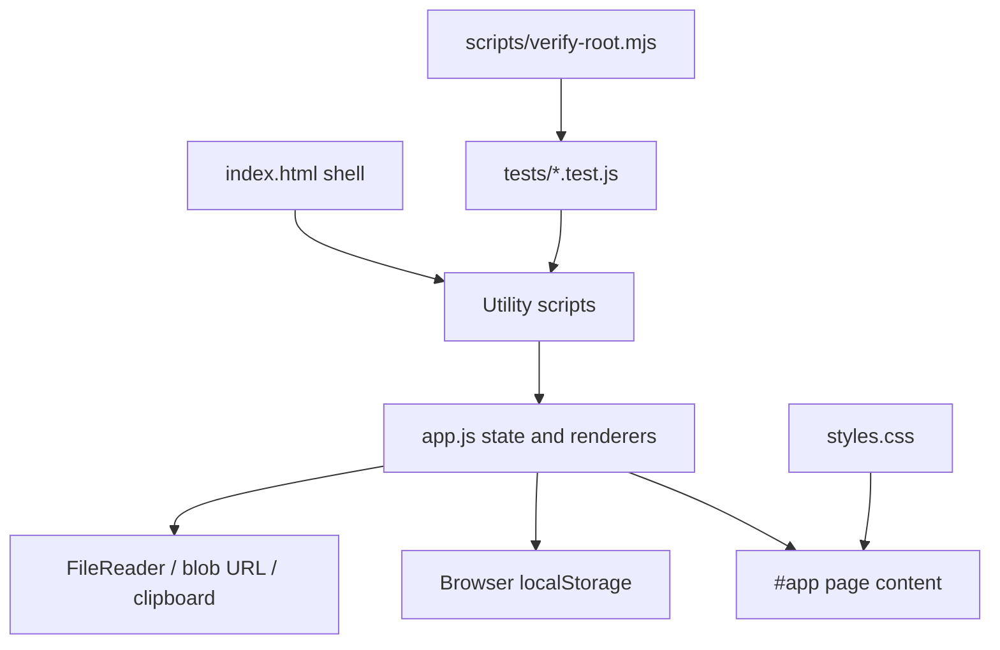
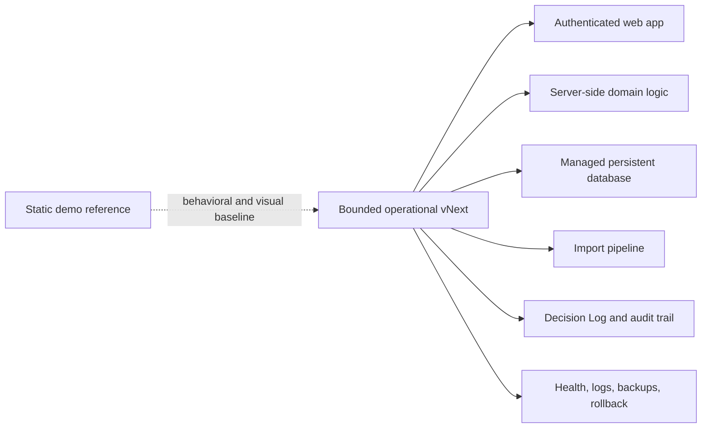

# System Architecture

## Document Status

- Status: Partially Verified
- Primary Evidence:
  - `index.html`
  - `app.js`
  - `styles.css`
  - `demoShared.js`
  - `pilotIntakeSafety.js`
  - `operationalCompression.js`
  - `operationalImpact.js`
  - `demoWalkthrough.js`
  - `pilotReadinessPack.js`
  - `demoControlCenter.js`
  - `tests/`
  - `scripts/verify-root.mjs`
  - `.github/workflows/root-static-checks.yml`
  - `apps/operational/`
  - `.github/workflows/operational-ci.yml`
  - `apps/operational/src/server/db/schema/`
  - `apps/operational/src/server/tenancy/`
  - `apps/operational/drizzle/0000_open_giant_girl.sql`
  - `apps/operational/drizzle/0001_office-composite-key.sql`
  - `apps/operational/drizzle/0002_identity-membership-rbac.sql`
  - `apps/operational/drizzle/0003_vengeful_vapor.sql`
  - `apps/operational/drizzle/0004_right_reavers.sql`
  - `apps/operational/src/server/auth/`
  - `apps/operational/src/server/members/`
  - `apps/operational/src/server/operational-records/`
  - `docs/CMTCOMMAND_BIBLE/decisions/ADR-007_SERVER_DERIVED_AUTHORIZATION_SCOPE.md`
  - `apps/operational/tests/integration/tenancy.integration.test.ts`
  - `apps/operational/tests/integration/operational-records.integration.test.ts`
  - `docs/CMTCOMMAND_BIBLE/plans/PHASE_5_TENANCY_FOUNDATION_REPORT.md`
  - `docs/CMTCOMMAND_BIBLE/plans/PHASE_5E_DURABLE_OPERATIONAL_RECORDS_REPORT.md`
  - `docs/CMTCOMMAND_BIBLE/13_FIELD_OPERATIONS_CAPTURE_AND_REPORTING.md`
  - `docs/CMTCOMMAND_BIBLE/decisions/ADR-006_FIELD_EVIDENCE_IMMUTABLE_AI_EXTRACTION_ADVISORY.md`
  - `docs/cmtcommand-vnext/baseline.md`
  - Founder decision recorded in the Phase 2 Founder Truth Capture task, 2026-07-13
  - Founder decision recorded in the Phase 3 Guarded Operational Architecture Selection task, 2026-07-13
- Last Reviewed: 2026-07-16

## Current Architecture - Confirmed

Root CMTCommand is a static HTML/CSS/JavaScript app. No root package manager, framework, backend, database, API route directory, auth service, schema, migration system, or deployment config was found.



## Current Major Layers

- Shell: `index.html` defines sidebar, topbar, search, appearance selector, theme button, global results, and `#app`.
- State/rendering: `app.js` owns demo data, state, page renderers, navigation, event wiring, localStorage reads/writes, copy, import, and download behavior.
- Styling: `styles.css` owns tokens, panels, badges, buttons, responsive rules, dark theme, and Command Center mode.
- Utilities: dependency-free UMD modules expose browser globals and CommonJS exports for tests.
- Tests: Node tests exercise deterministic utility behavior and static integration checks such as script order.
- CI: GitHub Actions workflow runs `node scripts\verify-root.mjs`.

## Script Load Order

`index.html` currently loads:

1. `demoShared.js`
2. `pilotIntakeSafety.js`
3. `operationalCompression.js`
4. `operationalImpact.js`
5. `demoWalkthrough.js`
6. `pilotReadinessPack.js`
7. `demoControlCenter.js`
8. `app.js`

`app.js` depends on utility globals. `pilotIntakeSafety.js` must precede `demoControlCenter.js` and `app.js`.

## Current State Management

- In-memory `state` object in `app.js`.
- Browser localStorage for known display/demo keys.
- Session-only Pilot Setup import/document state.
- No server-side state.

## Current External Services

No product external service integrations were found. Browser capabilities used locally:

- `FileReader`
- `localStorage`
- `navigator.clipboard`
- generated `blob:` URLs

The browser/CDP validation script under `docs/cmtcommand-vnext/artifacts/` uses local HTTP and Edge CDP for verification; it is not product runtime.

## Founder Decision - 2026-07-13

The current static application must remain intact as the trusted demo, product-reference implementation, and visual behavior baseline.

The operational pilot cannot remain a browser-local static application. It needs persistent server-side data, authentication, multiple users, role-based authorization, organization and office scoping, durable imports, durable readiness snapshots, an auditable Decision Log, managed deployment, monitoring, backups, and rollback.

Do not rewrite the existing demo in place. Create a clearly bounded operational implementation while preserving the demo. Phase 3 selected the architecture category and core stack; exact managed auth, database, and hosting providers remain checkpoints.

See [ADR-001](decisions/ADR-001_PRESERVE_STATIC_DEMO_AND_BUILD_OPERATIONAL_VNEXT.md).

## Pilot V1 Target Architecture



Target responsibilities for operational vNext:

- Persist imported source snapshots, validation results, readiness snapshots, decisions, and impact measurements.
- Enforce organization, office, role, and audit boundaries server-side.
- Keep readiness evaluation deterministic, testable, and explainable.
- Generalize the TRD-104/Maria Lopez workflow to imported customer data without hardcoding fictional records.
- Keep current static demo behavior available as a reference during implementation.

## Architecture Selection - 2026-07-13

Phase 3 selects Operational vNext as a full-stack TypeScript modular monolith using Next.js App Router on the Node.js runtime, PostgreSQL, Drizzle ORM/Drizzle Kit, Zod, Vitest, Playwright, managed authentication category, server-side app-owned authorization, and a managed Next.js/PostgreSQL deployment category.

Phase 4 created the Operational vNext scaffold in `apps/operational/` without moving the root static demo.

Governing documents:

- [ADR-002 Operational vNext Application Architecture](decisions/ADR-002_OPERATIONAL_VNEXT_APPLICATION_ARCHITECTURE.md)
- [ADR-003 Operational vNext Repository Boundary](decisions/ADR-003_OPERATIONAL_VNEXT_REPOSITORY_BOUNDARY.md)
- [ADR-004 Tenancy Authorization And Audit Model](decisions/ADR-004_TENANCY_AUTHORIZATION_AND_AUDIT_MODEL.md)
- [ADR-005 Import And Readiness Execution Model](decisions/ADR-005_IMPORT_AND_READINESS_EXECUTION_MODEL.md)
- [Operational vNext Architecture Blueprint](plans/OPERATIONAL_VNEXT_ARCHITECTURE_BLUEPRINT.md)
- [Phase 4 Scaffolding Report](plans/PHASE_4_SCAFFOLDING_REPORT.md)

## Operational vNext Scaffold - Confirmed

`apps/operational/` is an independent Next.js App Router application shell with:

- App-local `package.json` and `package-lock.json`.
- TypeScript, ESLint, Vitest, Playwright, Drizzle Kit, and Next.js configuration.
- A minimal scaffold page that avoids Pilot V1 business behavior.
- `GET /api/health` for liveness without PostgreSQL.
- `GET /api/ready` for PostgreSQL readiness with 503 when unconfigured or unavailable.
- Lazy Drizzle/PostgreSQL wiring through `pg`.
- A path-scoped workflow in `.github/workflows/operational-ci.yml`.

That Phase 4 scaffold alone was technical infrastructure, not proof that Pilot
V1 auth, tenancy, imports, readiness, coverage, Decision Log, audit, deployment,
or domain persistence existed. Later sections record the implemented Phase 5,
Phase 5D, and bounded Phase 5E foundations.

## Phase 5 Tenancy Foundation - Confirmed

Operational vNext now has a first durable persistence boundary for
organizations and offices only:

- `apps/operational/src/server/db/schema/organizations.ts`
- `apps/operational/src/server/db/schema/offices.ts`
- `apps/operational/src/server/tenancy/scope.ts`
- `apps/operational/src/server/tenancy/repository.ts`
- `apps/operational/drizzle/0000_open_giant_girl.sql`

Office reads go through explicit organization-wide or office-limited access
scopes. Setup-level organization and office creation functions are internal
persistence operations, not public HTTP endpoints.

This remains the setup-level organization/office boundary. Protected callers now
receive its scopes from the Phase 5D request authorization path rather than from
browser input.

## Phase 5D Identity And RBAC Foundation - Confirmed

Operational vNext now implements the provider-neutral request path:

```text
Verified provider identity
    -> CMTCommand application user
    -> active organization membership
    -> authorized office scope
    -> derived permissions
    -> tenant-scoped service/repository operation
```

Primary runtime boundaries:

- `src/server/auth/runtime-config.ts` keeps production auth disabled until a
  provider is selected and makes the development adapter impossible in a
  production runtime.
- `src/server/auth/session.ts` signs allowlisted development identities without
  accepting trusted identity headers.
- `src/server/auth/repository.ts` maps provider/subject to application user and
  current membership/office facts.
- `src/server/auth/resolver.ts` fails closed for unknown, disabled, suspended,
  invited, revoked, unaffiliated, inactive-organization, and invalid-policy states.
- `src/server/auth/permissions.ts` is the centralized role policy.
- `src/server/members/service.ts` owns scoped, actor-revalidated, transactional
  membership and office-access mutations.
- `/app` and `/app/admin/members` are protected Server Component surfaces;
  Server Actions re-enforce authorization for writes.
- `/api/auth/context` and `/api/offices` are thin, no-store route handlers over
  the same server-derived context.

Multiple organization memberships are supported. The active organization is an
optional signed session selection and is validated against active membership on
every request. Role, organization, office scope, and permissions are never read
from browser claims.

No production identity provider, invitation delivery, general audit-event table,
readiness workflow, coverage workflow, or Field Operations runtime is implied.
See [ADR-007](decisions/ADR-007_SERVER_DERIVED_AUTHORIZATION_SCOPE.md) and the
[Phase 5D report](plans/PHASE_5D_IDENTITY_RBAC_REPORT.md).

## Phase 5E Durable Operational Records - Confirmed

Operational vNext now has four durable operational-record tables:

- `projects`
- `technicians`
- `work_orders`
- `dispatch_assignments`

All four require organization and office ownership. Internal UUIDs remain
separate from normalized source-system/source-record identifiers and from human
project or work-order numbers. Composite foreign keys enforce office and
organization agreement from work order to project and from dispatch assignment
to work order and technician. Relationship deletion is restrictive.

`src/server/operational-records/` provides Zod validation plus scoped create,
list, and find services. Reads apply the server-derived organization/office
scope. Creates check the central permission policy, serialize on the owning
organization, and revalidate the current user, organization, membership, role
permission, and office access inside the database transaction. Create results
include safe actor-attributed mutation metadata, but no general audit event is
persisted.

The implemented role boundary is intentionally narrow:

- Organization admin and operations manager: read/manage all four record types.
- Dispatcher: read all four; manage dispatch assignments only.
- Technical reviewer and viewer: read all four; no Phase 5E writes.
- Field technician: no Phase 5E operational-record permission.

Phase 5E exposes no operational-record route, Server Action, or product UI. It
does not implement imports, durable Service Type records, readiness, coverage,
Decision Log behavior, persistent general audit events, or Field Operations
runtime. See the [Phase 5E report](plans/PHASE_5E_DURABLE_OPERATIONAL_RECORDS_REPORT.md).

## Future Field Operations Architecture - Path B

Field Operations Capture & Report Intelligence is documented as a future
Operational vNext workstream. It does not change the founder-approved 90-day
Tomorrow Readiness and Coverage pilot and has no current runtime implementation.

The future module boundary connects existing authorized assignments to:

- Field sessions.
- Private immutable evidence and separate derivatives.
- Provider-neutral advisory extraction.
- Human-reviewed report drafts and immutable report versions.
- Sample/cylinder status events.
- Dispatcher field-status projections.
- Version-specific exports and external synchronization receipts.

The identity, membership, office access, and RBAC prerequisite is implemented as
a local foundation. Phase 5E also supplies durable project, work-order,
technician, and dispatch-assignment records, but the P2 gate remains partial
because there is no durable Service Type record. Field Operations remains
blocked on production identity, completion of P2, general audit-event
persistence, and a private object-storage/upload boundary. It still must not
begin as field-reporting tables or UI.

See [Field Operations Capture And Reporting](13_FIELD_OPERATIONS_CAPTURE_AND_REPORTING.md),
[Field Operations V1](specs/FIELD_OPERATIONS_V1.md),
[ADR-006](decisions/ADR-006_FIELD_EVIDENCE_IMMUTABLE_AI_EXTRACTION_ADVISORY.md),
and the [Field Operations Implementation Plan](plans/FIELD_OPERATIONS_IMPLEMENTATION_PLAN.md).

## Known Constraints

- `app.js` is large and highly coupled to page rendering/state.
- Static architecture makes real auth, persistence, integrations, and server-side validation absent.
- UI rendering uses HTML strings for many static/demo-controlled surfaces, so user-derived input must use explicit safe sinks.
- Root CMTCommand shares a Git repository with unrelated `euchre-platform/` files.
- Exact managed auth, database, hosting, monitoring, backup, and recovery providers remain checkpoints.

## Inferred Design Intent

The current architecture favors a low-friction local demo with tested pure utility boundaries instead of a framework app. Founder direction now preserves that demo while authorizing a separate operational architecture path.

## Potentially Outdated Or Conflicting Evidence

`docs/cmtcommand-vnext/plan.md` mentions root `src/` and `migrations/` directories existed during earlier phases, but the current root scan did not find active root files there. Treat current filesystem evidence as authoritative for the current demo.

## Implementation Gaps

- Operational app scaffolding, tenancy persistence, provider-neutral identity,
  memberships, office assignments, protected shell, centralized RBAC, and the
  four Phase 5E operational-record types exist. No Tomorrow Readiness or
  Coverage business module exists.
- Exact managed auth, database, and hosting providers remain checkpoints.
- Production authentication remains fail-closed until a provider is selected;
  the current signed adapter is development/test only.
- General persistent security audit events and PostgreSQL RLS remain deferred.
- Durable Service Type, import, availability, certification, clearance,
  equipment, calibration, and service-requirement foundations remain absent.
- No durable readiness snapshot or Decision Log implementation exists.
- No route or UI exposes the Phase 5E operational-record services.
- Field Operations remains architecture-only; no field session, evidence,
  report, sample, media, extraction, export, or field UI implementation exists.

## Open Questions

- [OPEN QUESTION - High Impact] Which exact managed authentication provider should replace the disabled production boundary before pilot deployment?
- [OPEN QUESTION - High Impact] Which exact managed PostgreSQL provider should be selected before pilot deployment configuration?
- [OPEN QUESTION - High Impact] Which exact managed Next.js hosting provider should be selected before pilot deployment configuration?
- [OPEN QUESTION - Medium Impact] When should current demo logic be extracted or shared with operational vNext, if ever?
- [OPEN QUESTION - Medium Impact] Should unrelated nested projects be split out before operational architecture work begins?
- [OPEN QUESTION - High Impact] Which private storage, media-inspection, retention, and technical-review decisions must be approved before Field Operations FR-1?
