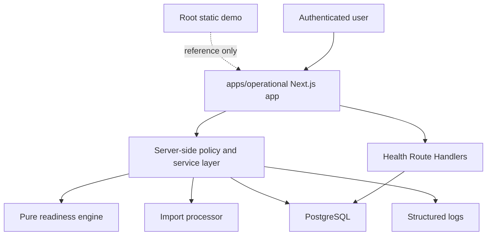
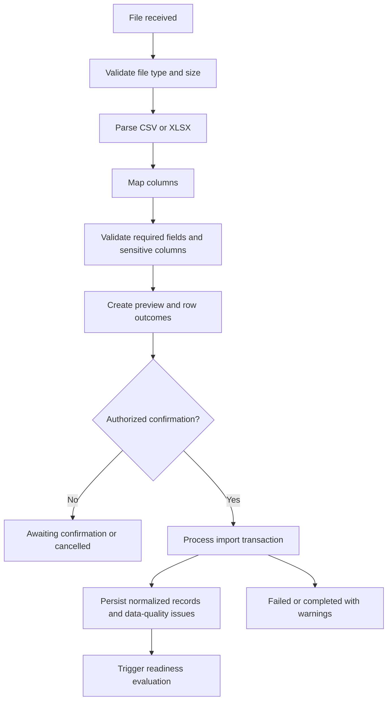
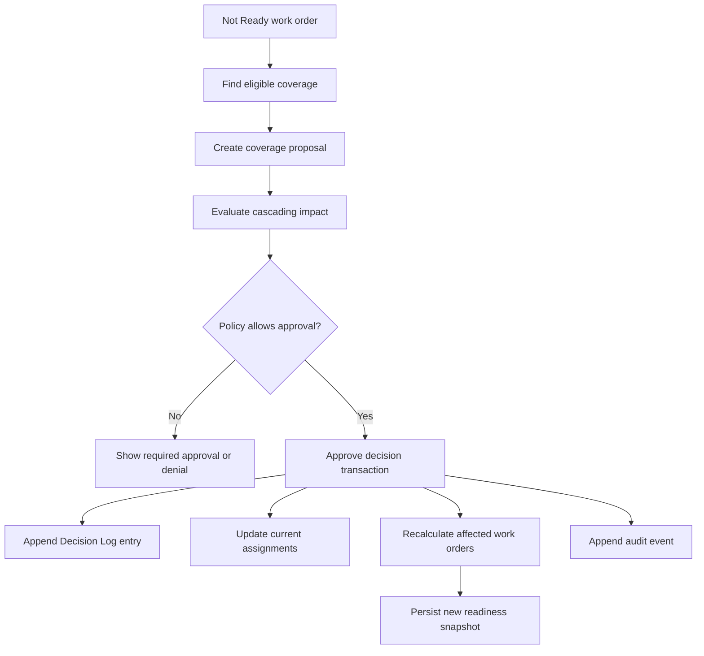
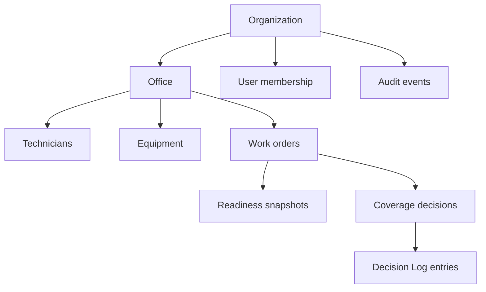

# Operational vNext Architecture Blueprint

## Document Status

- Status: Draft
- Primary Evidence:
  - Founder decision recorded in the Phase 3 Guarded Operational Architecture Selection task, 2026-07-13
  - `docs/CMTCOMMAND_BIBLE/specs/PILOT_V1_TOMORROW_READINESS_AND_COVERAGE.md`
  - `docs/CMTCOMMAND_BIBLE/decisions/ADR-001_PRESERVE_STATIC_DEMO_AND_BUILD_OPERATIONAL_VNEXT.md`
  - `docs/CMTCOMMAND_BIBLE/decisions/ADR-002_OPERATIONAL_VNEXT_APPLICATION_ARCHITECTURE.md`
  - `docs/CMTCOMMAND_BIBLE/decisions/ADR-003_OPERATIONAL_VNEXT_REPOSITORY_BOUNDARY.md`
  - `docs/CMTCOMMAND_BIBLE/decisions/ADR-004_TENANCY_AUTHORIZATION_AND_AUDIT_MODEL.md`
  - `docs/CMTCOMMAND_BIBLE/decisions/ADR-005_IMPORT_AND_READINESS_EXECUTION_MODEL.md`
  - `apps/operational/drizzle/0000_open_giant_girl.sql`
  - `apps/operational/src/server/tenancy/`
  - `docs/CMTCOMMAND_BIBLE/plans/PHASE_5_TENANCY_FOUNDATION_REPORT.md`
- Last Reviewed: 2026-07-14

## Architecture Summary

Operational vNext is a TypeScript modular monolith for the Pilot V1 Tomorrow Readiness + Coverage Decision System. It should be introduced in a future `apps/operational/` directory without moving or rewriting the root static demo.

The selected architecture is:

- Full-stack TypeScript web application.
- Next.js App Router on the Node.js runtime.
- PostgreSQL managed relational database.
- Drizzle ORM and Drizzle Kit migrations.
- Zod runtime validation at untrusted boundaries.
- Managed authentication provider category with app-owned memberships, RBAC, office scope, and audit history.
- Pure deterministic TypeScript readiness engine.
- Controlled CSV/XLSX imports with database-tracked lifecycle and row outcomes.
- Managed deployment category with development, staging, and pilot-production environments.

The full blueprint is target-state architecture. Phase 4 implemented the app
shell. Phase 5 through Phase 5G now implement local/test foundations for
tenancy, identity/RBAC, operational dispatch records, general audit persistence,
and private assignment media primitives.

## Selected Stack

| Layer | Selected direction |
| --- | --- |
| Repository location | Future `apps/operational/`; root static demo remains in place. |
| Package boundary | App-local package manifest in `apps/operational/`; no root workspace until justified. |
| Framework | Next.js App Router. |
| Runtime | Node.js. |
| Language | TypeScript end to end. |
| Database | Managed PostgreSQL or PostgreSQL-compatible managed relational database. |
| ORM/migrations | Drizzle ORM plus Drizzle Kit migrations. |
| Validation | Zod schemas for API/action/import boundaries. |
| Authentication | Managed identity provider category, exact provider checkpoint before auth scaffolding. |
| Authorization | App-owned server-side policy module and scoped data-access helpers. |
| Unit/integration tests | Vitest target. |
| Browser/E2E tests | Playwright target. |
| File parsing | Server-side CSV/XLSX parser packages selected during dependency review. |
| Import execution | In-app database-tracked import jobs; no distributed queue by default. |
| Deployment | Managed Next.js-capable platform plus managed PostgreSQL. |
| Health checks | App liveness and database connectivity Route Handlers. |

## Runtime Topology

## Module Map

| Module | Responsibility | Must not own |
| --- | --- | --- |
| Identity and access | Session context, memberships, roles, permissions. | Readiness rules. |
| Organizations and offices | Organization/office configuration and scopes. | External auth identity management. |
| People readiness | Technicians, availability, certifications, clearances. | UI-specific status rendering. |
| Equipment readiness | Equipment, availability, calibrations. | Coverage approval. |
| Work orders | Projects, job sites, service types, assignments. | Import parsing. |
| Service requirements | Required certs, clearances, equipment by service type. | Rule evaluation output storage. |
| Imports | File validation, preview, row outcomes, import history. | Readiness business rules. |
| Readiness evaluation | Deterministic status and explanations. | Database queries or auth. |
| Coverage decisions | Candidate eligibility, proposals, approval, cascading impact. | Authentication provider integration. |
| Decision Log and audit | Business decision history and system audit events. | Mutable current operational state. |
| Private media storage | Provider-neutral assignment media upload/read grants, immutable originals, and derivatives. | Field Sessions, reports, OCR/AI extraction, samples, and production storage/IAM. |
| Data quality | Import and operational data issues. | User identity. |
| Operational impact | Pilot issue caught/time saved measurements. | Pricing, billing, exact ROI. |

## Request Flow

1. Request reaches Next.js app.
2. Server resolves authenticated identity.
3. App loads internal user, organization membership, office scope, and roles.
4. Policy module authorizes action.
5. Service layer validates input with Zod.
6. Data-access layer applies organization and office scope.
7. Domain engine or import service executes.
8. Transaction persists results, audit events, and view data.
9. UI receives a view model.

## Data Flow

Customer source data enters only through controlled imports. CMTCommand stores source identifiers, normalized operational records, readiness outputs, decisions, audit events, and impact measurements. Customer systems remain authoritative for underlying scheduling/personnel/equipment records.

## Import Flow

## Readiness Evaluation Flow

1. Gather explicit facts from persisted records for a scoped organization/office.
2. Build domain input objects.
3. Pass inputs and rule version to pure readiness engine.
4. Engine returns rule results and final status.
5. Service persists readiness snapshot and rule results.
6. UI reads snapshot-derived view models.

## Coverage Approval Flow

## Authentication And Authorization Flow

1. Managed auth provider authenticates identity.
2. App session maps external identity to internal user.
3. Membership query resolves organization, office scope, roles, and disabled status.
4. Policy module evaluates the requested action.
5. Scoped data-access helper constrains queries by organization and office.
6. Audit event records sensitive allowed/denied actions where appropriate.

## Audit Flow

- Business decisions create Decision Log entries.
- Security/system actions create audit events.
- Decision corrections append new records referencing previous entries.
- Readiness snapshots preserve historical rule outputs.
- Current operational state remains separate from append-only history.

## Conceptual Data Model

| Entity | Purpose | Ownership | Identifiers | Mutable or append-only | Audit / retention notes |
| --- | --- | --- | --- | --- | --- |
| Organization | Customer firm boundary. | Global; owns tenant data. | Internal id, customer name. | Mutable config. | Never cross-query without explicit platform policy. |
| Office | Operational location. | Organization. | Internal id, office code/name. | Mutable config. | Required for pilot scoping. |
| User | Human identity mapping. | Global identity plus organization memberships. | Internal id, auth provider id, work email. | Mutable. | Disable rather than delete when history exists. |
| Membership | User's organization access. | Organization. | Internal id, user id, organization id. | Mutable status. | Role changes audited. |
| Role assignment | Permission source. | Organization/office. | Internal id, role key. | Mutable; changes audited. | Keep role history through audit events. |
| Technician | Operational person resource. | Organization, office. | Internal id, source id, business name. | Mutable current record. | Avoid forbidden personal data. |
| Technician availability | Availability facts. | Organization, office. | Internal id, technician id, source id/time range. | Mutable by import snapshot. | Source-system identifier retained. |
| Certification type | Certification taxonomy. | Organization or global seed. | Internal id, code/name. | Mutable with caution. | Changes affect readiness rules. |
| Technician certification | Technician certification status. | Organization, office. | Internal id, technician id, source id. | Mutable current record. | Expiration feeds readiness. |
| Clearance type | Clearance taxonomy. | Organization. | Internal id, code/name. | Mutable with caution. | Do not store full background reports. |
| Technician clearance | Clearance status. | Organization, office. | Internal id, technician id, clearance type. | Mutable current record. | Store status only. |
| Equipment type | Equipment taxonomy. | Organization. | Internal id, code/name. | Mutable. | May feed service requirements. |
| Equipment unit | Individual equipment. | Organization, office. | Internal id, source id, asset number. | Mutable current record. | Availability feeds readiness. |
| Calibration | Calibration status. | Organization, office. | Internal id, equipment id, source id. | Mutable current record. | Expiration feeds readiness. |
| Project | Project context. | Organization, optional office. | Internal id, source project id, project number. | Mutable current record. | PM visibility may apply. |
| Job site | Work location context. | Organization, project. | Internal id, source id. | Mutable. | Address sensitivity reviewed. |
| Work order | Scheduled work. | Organization, office. | Internal id, source id, human work number such as TRD-104. | Mutable current record. | Human number is not primary key. |
| Service type | Type of work. | Organization. | Internal id, code/name. | Mutable with caution. | Drives requirements. |
| Service requirement | Required certs/equipment/clearances. | Organization. | Internal id, service type id. | Mutable with rule impact. | Changes require readiness recalculation. |
| Work assignment | Technician/equipment assignment. | Organization, office. | Internal id, work order id. | Mutable current state. | Changes tied to Decision Log. |
| Import batch | Import execution group. | Organization, office. | Internal id, checksum/idempotency key. | State machine. | Retain metadata and outcomes. |
| Import file | Uploaded file metadata. | Organization, office. | Internal id, checksum, filename. | Append-like metadata. | Raw retention unresolved. |
| Import row result | Row-level outcome. | Organization, office. | Internal id, import batch id, row number. | Append-only for import. | Avoid forbidden raw values in logs. |
| Readiness evaluation | Evaluation run. | Organization, office. | Internal id, rule version. | Append-only. | Links inputs to outputs. |
| Readiness rule result | Per-rule output. | Organization, office. | Internal id, evaluation id, rule id. | Append-only. | Stores explanation and severity. |
| Readiness snapshot | Work-order readiness view. | Organization, office. | Internal id, snapshot time/context. | Append-only. | Current status projects latest snapshot. |
| Coverage candidate | Evaluated candidate. | Organization, office. | Internal id, proposal/evaluation id. | Append-only per evaluation. | Ranking inputs retained. |
| Coverage proposal | Proposed resolution. | Organization, office. | Internal id, work order id. | State machine. | Approval creates decision. |
| Coverage decision | Approved/rejected action. | Organization, office. | Internal id, proposal id. | Append-only decision. | Corrections append new record. |
| Decision Log entry | Business operational history. | Organization, office. | Internal id, decision id. | Append-only. | Founder-visible history. |
| Audit event | System/security history. | Organization, optional office. | Internal id, actor id, event type. | Append-only. | Safe structured fields only. |
| Media upload session | Authorized direct-upload intent. | Organization, office, dispatch assignment. | Internal id, idempotency key. | Mutable until completed or failed. | Storage coordinates hidden from public responses. |
| Media asset | Immutable original assignment media fact. | Organization, office, dispatch assignment. | Internal id, upload session id, hash. | Append-only original fact. | Retention/delete-under-policy remains unresolved. |
| Media derivative | Preview or thumbnail derived from an original. | Organization, office, media asset. | Internal id, derivative type. | Append-only derived fact. | Processor/version recorded. |
| Data-quality issue | Import or operational data problem. | Organization, office/import. | Internal id, issue code. | Append-only or resolved with status. | Retain for pilot quality reporting. |
| Operational-impact measurement | Issue caught/time saved snapshot. | Organization, office. | Internal id, snapshot id. | Append-only measurement. | Formula unresolved. |

Use internal UUIDs or equivalent stable internal identifiers as primary keys. Store customer source-system identifiers separately. Store human-readable operational numbers such as `TRD-104` as display/source identifiers, never as sole primary keys.

## Organization And Office Ownership

## Environment Model

- Development: local developer app plus local/containerized PostgreSQL or managed dev database.
- Staging: deployed environment with staging auth provider settings and staging database.
- Pilot production: deployed environment with pilot auth provider settings, pilot database, backups, monitoring, and rollback.

No environment variables or config files are created in this phase.

## Deployment Model

Target a managed Next.js-capable host with deployment history, HTTPS,
protected secrets, structured logs, rollback, and monitoring. Target managed
PostgreSQL with automated backups and restore procedure. Phase 5H approves the
managed-provider categories but not specific vendors; provider selection still
requires Phase 5I evidence and founder approval.

## Backup And Recovery Model

- Managed PostgreSQL automated backups required.
- Document restore process before pilot production.
- Exercise database recovery before pilot launch.
- App rollback should restore previous deployment without mutating database history.
- Database rollback should prefer restore/recovery procedures over destructive edits.

## Logging And Monitoring

Structured logs should include safe identifiers:

- request id
- actor id
- organization id
- office id
- import batch id
- work order id
- decision id
- error category

Do not log forbidden sensitive data, raw imported row payloads, credentials, tokens, or full customer files.

## Security Boundaries

- Managed auth proves identity.
- App-owned policy proves authorization.
- Data-access layer applies organization/office scope.
- Domain engine does not perform auth and cannot fetch extra data.
- Import module treats files, columns, cells, filenames, and row values as untrusted.
- Decision Log and audit are append-only.

## Testing Architecture

| Layer | Target |
| --- | --- |
| Domain unit | Vitest tests for readiness rules, precedence, coverage eligibility, ranking, cascading effects, decisions, data-quality rules. |
| Persistence/integration | Database tests for constraints, organization/office scoping, imports, transactions, audit history, media storage, decision corrections, snapshots. |
| Authorization | Permitted and denied tests for every role and capability. |
| UI | Playwright/component tests for readiness board, action queue, coverage, approval, import preview, failure states, decision history. |
| End-to-end | Seeded TRD-104-equivalent imported scenario using generalized records. |
| Static demo | Existing `node scripts\verify-root.mjs` remains required for root demo. |

## Implementation Order

1. Phase 4 guarded scaffolding: create app shell, package boundary, TypeScript, tests, database connection pattern, health route, and empty module structure. No business features.
2. Phase 5 tenancy foundation: organizations, offices, first migration, explicit access scopes, scoped office persistence, PostgreSQL isolation tests, and PostgreSQL CI job. No authentication, memberships, RBAC, or product workflows.
3. Identity and RBAC foundation: users, organization memberships, office access assignments, server-enforced roles and permission checks.
4. Data foundation remainder: technicians, certifications, clearances, equipment, calibrations, work orders, projects, job sites, service requirements, assignments.
5. Import pipeline.
6. Readiness engine.
7. Coverage decision workflow.
8. Pilot user experience.
9. Security and pilot operations.
10. Pilot validation and release.

## Known Risks

- Visual drift from static demo.
- Over-coupling domain logic to Next.js route/action code.
- Treating generated database types as domain models.
- Under-testing denied authorization cases.
- Import retention accidentally storing forbidden sensitive data.
- Provider-specific deployment assumptions before account/security review.
- Adding queue infrastructure before measured need.

## Deferred Decisions

- Exact managed auth provider.
- Exact managed hosting provider.
- Exact managed PostgreSQL provider.
- Exact CSV/XLSX parser packages.
- Raw-file retention and deletion periods.
- RPO/RTO values.
- Readiness warning thresholds.
- Coverage-ranking weights.
- Significant-change approval threshold.
- Operational-impact formula.
- Snapshot replacement versus incremental imports.

## Definition Of Architecture-Ready

Architecture is ready for guarded scaffolding when:

- Static-demo preservation rules are accepted.
- `apps/operational/` boundary is accepted.
- Full-stack TypeScript modular monolith is accepted.
- Next.js App Router, Node.js runtime, PostgreSQL, Drizzle, Zod, Vitest, and Playwright are accepted as target stack.
- Auth provider, hosting provider, and database provider can remain checkpoints because Phase 4 scaffolding can prove local shell/toolchain without real pilot data or live deployment.
- Blocking product questions are not required for an empty app shell.

Current conclusion: see [Phase 4 Scaffolding Readiness Checklist](PHASE_4_SCAFFOLDING_READINESS_CHECKLIST.md).
